## BEV Map Visualization
We can observe hear the roof for all cars looks similar
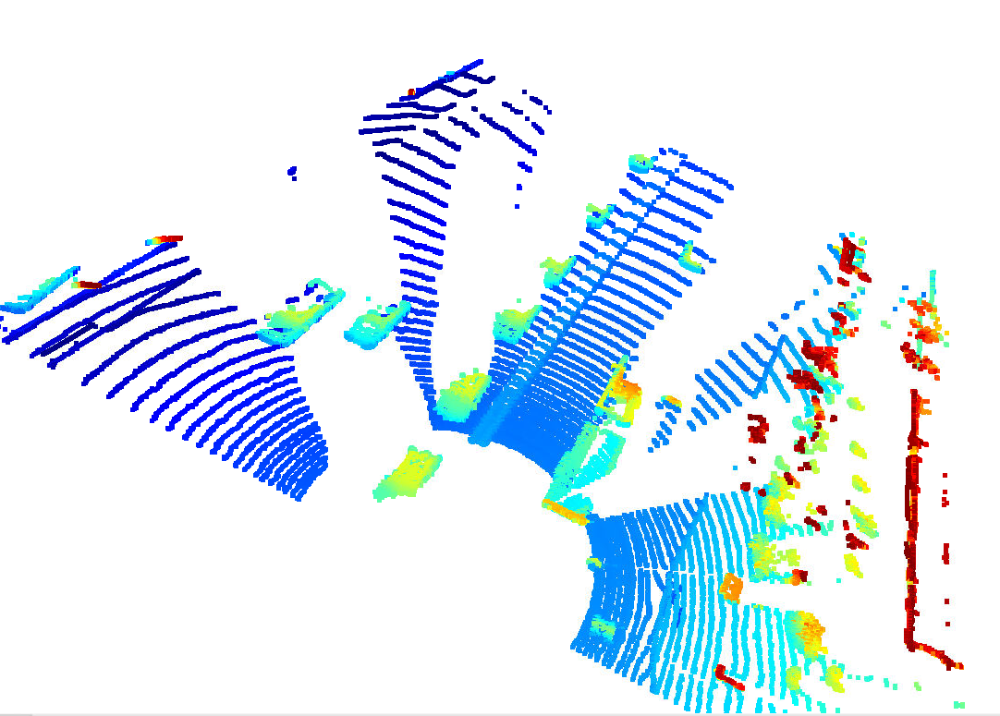
Wonderfully, the point cloud is able to identify the narrow route
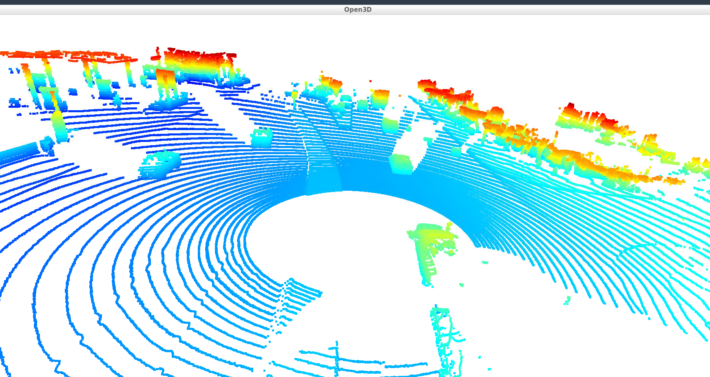
Here we can see the tiers are visible enough, we can help identify the cars easily
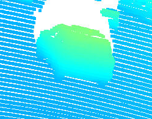
Windsheilds are not lidar reflective, which is a unique feature for cars
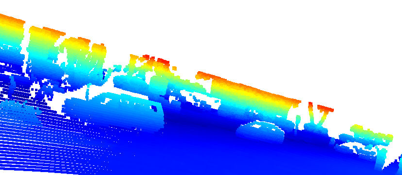
Pedestrians can be identified easily as well
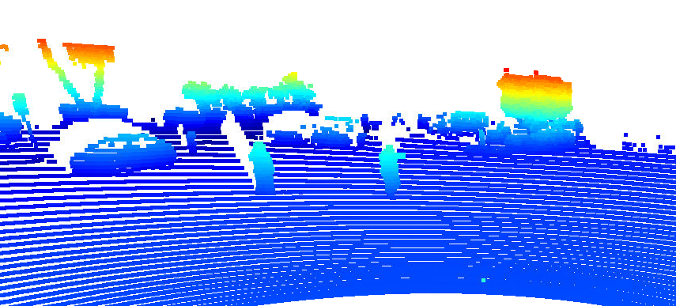
Cones are a bit ambigious and hard to predict what it is without supplement information from camera images
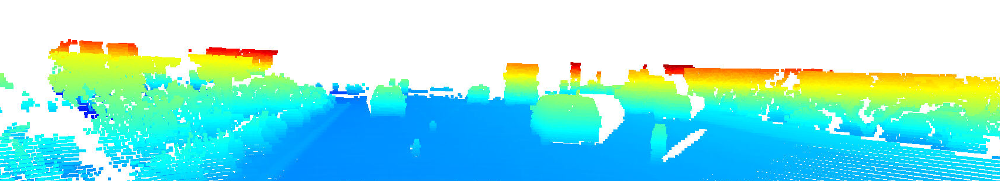
Cones from different perspective
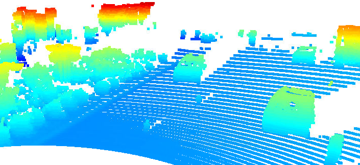
Wheels and lower part of cars (back-bumper) are unique, it's a bit blurry
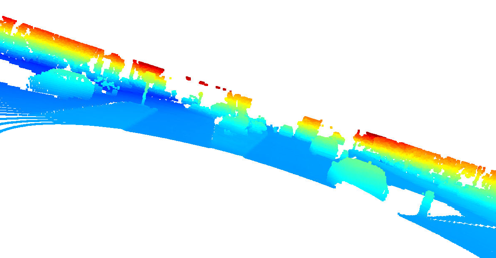
Viewing the cars from down to top show some empty spaces within the cars
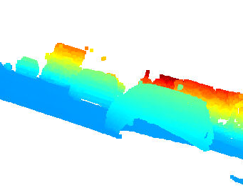
Windsheilds are non-reflective
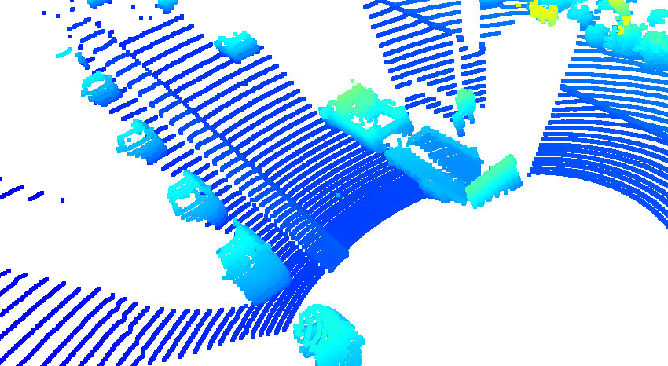

## Range & Intensity Images

Windsheild, taillamps, and license plate are light reflective. There're some random reflective objects but they are non consistent across the terms
so it can be eliminated somehow

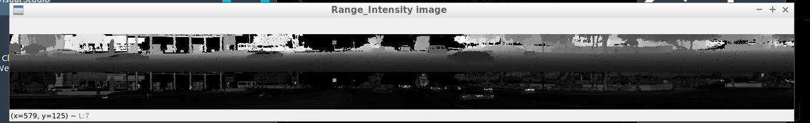
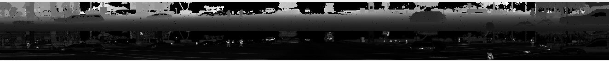

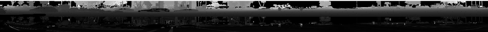
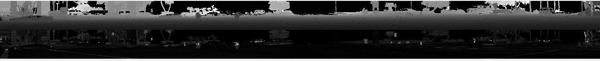
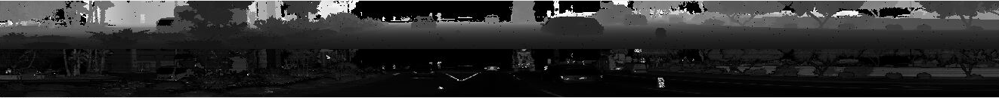
